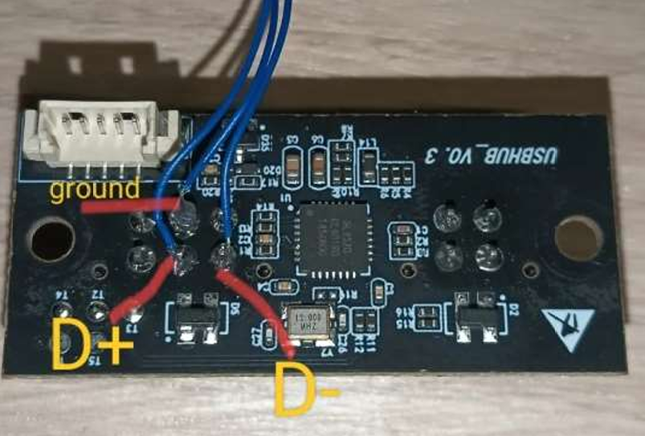
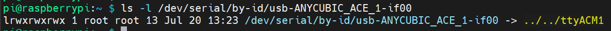

<p align="center">
  
  <h1 align="center">KDragonACE</h1>
</p>


* [英文文档 - English Documentation](./README_EN.md)
* 本项目基于 [BunnyACE](https://github.com/BlackFrogKok/BunnyACE) Fork，BunnyACE又源自[DuckACE](https://github.com/utkabobr/DuckACE)。感谢大佬们开源。
* 本版本着重优化串口通信稳定性，提升 Klipper 的兼容性，特别针对 ACE Pro 长时间打印过程中偶发断联问题做出改进。
* [Mainsail前端适配](https://github.com/Sukhoi-air/mainsail-ace)

---

## 🚀 本项目主要改进（相较于 BunnyACE）

- 🔧 **重构底层串口读写逻辑**
  - 提升通信效率，降低阻塞和数据堆积风险

- 🔄 **新增串口断连检测与自动重连机制**
  - 遇到临时拔插、异常中断时自动重连，不影响打印流程

- 🧠 **优化 Klipper reactor 调用逻辑**
  - 避免非线程安全调用，增强与 Klipper 主循环的调度兼容性

### ✅ 综合修复 ACE Pro 长时间打印断联问题（实验验证）

上述三项修改协同作用，在 ACE Pro 实机环境下经过 **连续 72 小时打印测试**，**未出现断联**问题。

> ⚠️ 目前尚无法百分百确认是否彻底解决所有断联场景，但实际测试表现良好，欢迎社区反馈更多使用案例。

---

## 🧪 使用方法

### 1. 硬件安装
ACE Pro与上位机通过USB连接：
1. 拆开ACE Pro后盖，取出USB Hub小板：
      <p align="center">
        
      </p>
2. 购买[TypeC转接板（4焊点）](https://item.taobao.com/item.htm?id=888317785527&pisk=gt1LscXcolq3OgfpSwyirAU-hdUMpRbF7M7jZ3xnFGIO2Z3hKLxkFQIVDLGuLBvJwGtGtHbHOU95qi6HA9xow_INvXckOgVJVZWazHYht4L5CMhlKwxhB4dFs9ckxkRRPiA8moV0iw7eUQZ0m2A0XDOXkbMSqH9s1QYRIwMnlw7ea3giV-X184QadYuBP3a91ULIAQGWPAa9yEKWNH9SfATXfQOWAXt6fULSRv9WNP368eGBRXGI5fTDrDOWNg__WU-6RQOSw2apb2TKw9IUTfELatlSN1LpCRjef_18revpwwKTco1OgpKfRhh7mFQCB3KNGl2O7iBCxFS8MldPbTsWyGi_qp75BGLdxonyq67hwHbLdl_9sHd1Ot3SNNdpYL5WLDE9c671gC9gGrQ1_MbF6a07NFjDfw5BwSa29BtB6F5ubXtRCT1HLQoQmp75BGLpGg-OisLyrmxvrvaTWYkydFW_PGAMIRhcqFK0RpMrULYwWn4TWYMS0jL9myGiUYJ9z&spm=tbpc.boughtlist.suborder_itemtitle.1.480e2e8dTa9ExH)；
  <p align="center">
      
    </p>
3. 将USB Hub小板与TypeC转接板连接，并使用**木头楼主MTLZ**大佬的模型（STLs/ace_pro_TypeC_Cover_by木头楼主.stl）固定
    <p align="center">
      
    </p>
    <p align="center">
      
    </p>
4. 使用USB C to A数据线连接ACE Pro与klipper上位机。之后进入上位机终端，使用 `ls -l /dev/serial/by-id/usb-ANYCUBIC_ACE_1-if00` 是否存在，如果不存在请检查上述步骤
    <p align="center">
      
    </p>

### 2. klipper插件安装
1. Clone source code:
    ```shell
    git clone https://github.com/GofranChang/KDragonACE.git
    ```
2. 安装插件
   ```
   cd KDragonACE
   ./instal.sh
   ```
3. 重启打印机

### 3. 软件调试
#### 常用命令
##### 1. ACE_FEED - 进料

| 参数 | 含义           | 示例值 |
|----|----|----|
| INDEX | 进料通道，从左到右依次为0、1、2、3 | 0 |
| LENGTH | 进料长度（mm） | 1000  |

使用示例：
```gcode
# 最左边的料架进料1000mm
ACE_FEED INDEX=0 LENGTH=1000
```

##### 2. ACE_RETRACT - 退料

| 参数 | 含义           | 示例值 |
|----|----|----|
| INDEX | 退料通道，从左到右依次为0、1、2、3 | 0 |
| LENGTH | 退料长度（mm） | 1000  |

使用示例：
```gcode
ACE_RETRACT INDEX=0 LENGTH=1000
```

##### 3. ACE_START_DRYING - 开启烘干

| 参数 | 含义           | 示例值 |
|----|----|----|
| TEMP| 烘干温度，建议不要超过65度| 55 |

使用示例：
```gcode
ACE_START_DRYING TEMP=55
```

##### 4. ACE_STOP_DRYING - 停止烘干

| 参数 | 含义           | 示例值 |
|----|----|----|
| 无| | |

使用示例：
```gcode
ACE_STOP_DRYING
```

##### 5. ACE_ENABLE_FEED_ASSIST - 开启辅助进料
为指定通道开启持续辅助进料功能。

| 参数 | 含义           | 示例值 |
|----|----|----|
| INDEX | 通道索引 | 0 |

使用示例：
```gcode
ACE_ENABLE_FEED_ASSIST INDEX=0
```

##### 6. ACE_DISABLE_FEED_ASSIST - 关闭辅助进料
关闭指定通道的辅助进料功能。

| 参数 | 含义           | 示例值 |
|----|----|----|
| INDEX | 通道索引 | 0 |

使用示例：
```gcode
ACE_DISABLE_FEED_ASSIST INDEX=0
```
---

#### 🚀 进阶命令

##### 状态管理类命令

###### 1. ACE_GET_CUR_INDEX - 获取当前工具索引
获取当前正在使用的工具索引号。

使用示例：
```gcode
ACE_GET_CUR_INDEX
```

###### 2. ACE_STATUS - 获取ACE设备完整状态
显示设备温度、风扇转速、烘干状态、所有料槽信息等详细状态。

使用示例：
```gcode
ACE_STATUS
```

###### 3. ACE_SET_STATUS - 手动设置状态
手动设置当前工具索引和料线位置状态。

| 参数 | 含义           | 示例值 |
|----|----|----|
| INDEX | 工具索引（-1表示无工具） | 0 |
| POS | 料线位置（spliter/bowden/toolhead/nozzle） | toolhead |

使用示例：
```gcode
ACE_SET_STATUS INDEX=0 POS=toolhead
```

###### 4. ACE_CLEAR_ALL_STATUS - 清除所有状态
重置当前工具索引为-1，料线位置为spliter。

使用示例：
```gcode
ACE_CLEAR_ALL_STATUS
```

##### 工具切换类命令（需要配置工具头挤出机双传感器）

###### 5. ACE_REJECT_TOOL - 卸载工具
卸载指定工具或当前工具。

| 参数 | 含义           | 示例值 |
|----|----|----|
| TOOL | 要卸载的工具索引（-1表示当前工具） | 0 |

使用示例：
```gcode
ACE_REJECT_TOOL TOOL=0
```

###### 6. ACE_CHANGE_TOOL - 切换工具
自动完成完整的工具切换流程，包括退料和新工具加载。

| 参数 | 含义           | 示例值 |
|----|----|----|
| TOOL | 目标工具索引 | 1 |

使用示例：
```gcode
# 切换到工具1
ACE_CHANGE_TOOL TOOL=1
```

###### 7. ACE_FILAMENT_STATUS - 料线状态可视化
在console显示耗材位置。

使用示例：
```gcode
ACE_FILAMENT_STATUS
```

##### 料槽管理类命令

###### 8. ACE_SET_SLOT_INFO - 设置料槽信息
设置并保存指定料槽的类型、颜色和SKU信息。

| 参数 | 含义           | 示例值 |
|----|----|----|
| INDEX | 料槽索引 | 0 |
| TYPE | 材料类型 | PLA |
| COLOR | RGB颜色值（r,g,b格式） | 255,0,0 |
| SKU | 产品SKU | PLA-RED-001 |

使用示例：
```gcode
ACE_SET_SLOT_INFO INDEX=0 TYPE=PLA COLOR=255,0,0 SKU=PLA-RED-001
```

#### 调试命令

##### 9. ACE_DEBUG - 调试接口
直接调用ACE设备的底层API进行调试。

| 参数 | 含义           | 示例值 |
|----|----|----|
| METHOD | API方法名 | get_info |
| PARAMS | JSON格式的参数 | {} |

使用示例：
```gcode
ACE_DEBUG METHOD=get_info PARAMS={}
```

