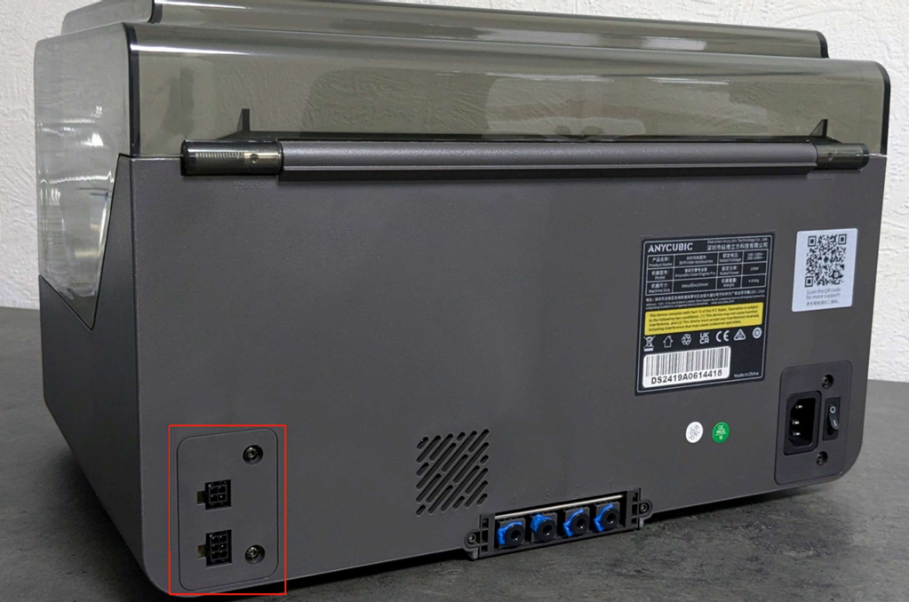
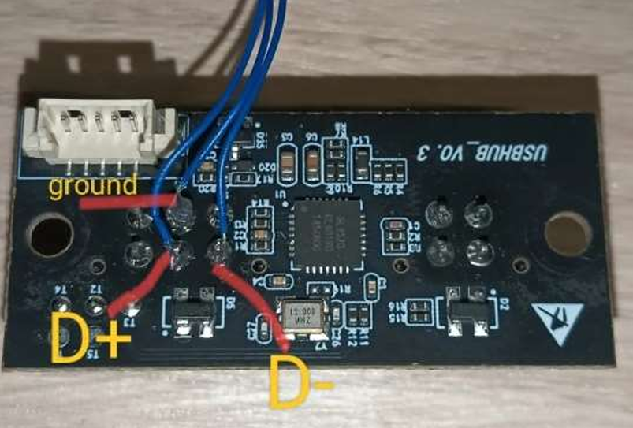
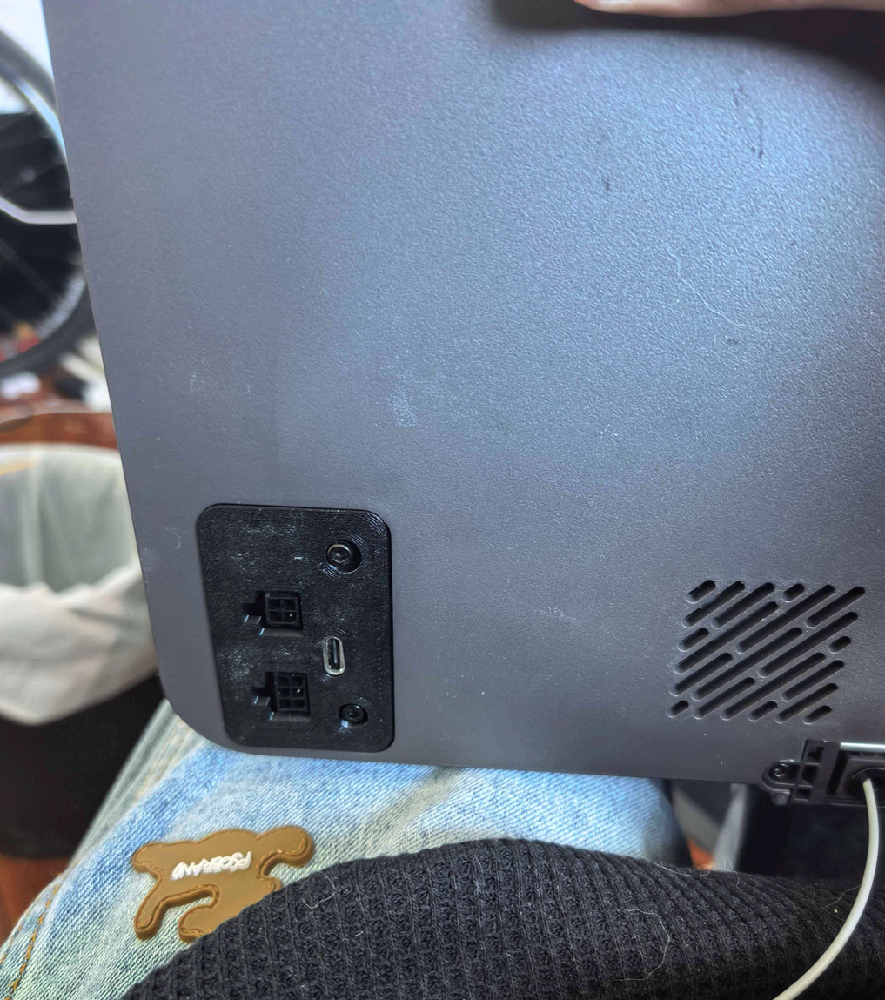

<p align="center">
  
  <h1 align="center">KDragonACE</h1>
</p>


* [中文文档 - Chinese Documentation](./README.md)
* This project is a fork of [BunnyACE](https://github.com/BlackFrogKok/BunnyACE), which itself originates from [DuckACE](https://github.com/utkabobr/DuckACE). Thanks to the original authors for open-sourcing their work.
* This version focuses on optimizing serial communication stability, improving Klipper compatibility, and specifically addressing occasional disconnection issues during long prints with ACE Pro.
* [Mainsail Frontend Adaptation](https://github.com/Sukhoi-air/mainsail-ace)

---

## 🚀 Key Improvements (Compared to BunnyACE)

- 🔧 **Refactored underlying serial read/write logic**
  - Improved communication efficiency, reduced blocking and data accumulation risks

- 🔄 **Added serial disconnection detection and automatic reconnection mechanism**
  - Automatically reconnects after temporary disconnection or interruption without affecting print progress

- 🧠 **Optimized Klipper reactor calling logic**
  - Avoids non-thread-safe calls, enhances scheduling compatibility with Klipper main loop

### ✅ Comprehensive Fix for ACE Pro Long Print Disconnection Issues (Experimentally Verified)

The above three modifications work synergistically. In real ACE Pro environments, after **72-hour continuous printing tests**, **no disconnections** were observed.

> ⚠️ While we cannot guarantee 100% resolution of all disconnection scenarios, actual testing shows excellent performance. Community feedback on additional use cases is welcome.

---

## 🧪 Usage Guide

### 1. Hardware Installation

ACE Pro connects to the host computer via USB:

1. Remove the ACE Pro back cover and take out the USB Hub board:
   <p align="center">
     
   </p>

2. Purchase [TypeC adapter board (4 solder points)](https://item.taobao.com/item.htm?id=888317785527&pisk=gt1LscXcolq3OgfpSwyirAU-hdUMpRbF7M7jZ3xnFGIO2Z3hKLxkFQIVDLGuLBvJwGtGtHbHOU95qi6HA9xow_INvXckOgVJVZWazHYht4L5CMhlKwxhB4dFs9ckxkRRPiA8moV0iw7eUQZ0m2A0XDOXkbMSqH9s1QYRIwMnlw7ea3giV-X184QadYuBP3a91ULIAQGWPAa9yEKWNH9SfATXfQOWAXt6fULSRv9WNP368eGBRXGI5fTDrDOWNg__WU-6RQOSw2apb2TKw9IUTfELatlSN1LpCRjef_18revpwwKTco1OgpKfRhh7mFQCB3KNGl2O7iBCxFS8MldPbTsWyGi_qp75BGLdxonyq67hwHbLdl_9sHd1Ot3SNNdpYL5WLDE9c671gC9gGrQ1_MbF6a07NFjDfw5BwSa29BtB6F5ubXtRCT1HLQoQmp75BGLpGg-OisLyrmxvrvaTWYkydFW_PGAMIRhcqFK0RpMrULYwWn4TWYMS0jL9myGiUYJ9z&spm=tbpc.boughtlist.suborder_itemtitle.1.480e2e8dTa9ExH)
   <p align="center">
     
   </p>

3. Connect the USB Hub board to the TypeC adapter board and secure using **木头楼主MTLZ**'s model (STLs/ace_pro_TypeC_Cover_by木头楼主.stl)
   <p align="center">
     
   </p>
   <p align="center">
     
   </p>

4. Use USB C to A cable to connect ACE Pro to Klipper host. Then enter host terminal and check if `ls -l /dev/serial/by-id/usb-ANYCUBIC_ACE_1-if00` exists. If not, check previous steps.
   <p align="center">
     
   </p>

### 2. Klipper Plugin Installation

1. Clone source code:
```shell
git clone https://github.com/GofranChang/KDragonACE.git
```

2. Install plugin:
```
cd KDragonACE
./install.sh
```

3. Restart printer

### 3. Software Debugging
#### Common Commands
##### 1. ACE_FEED - Feed Filament

| Parameter | Description | Example |
|-----------|-------------|---------|
| INDEX | Feed channel, from left to right: 0, 1, 2, 3 | 0 |
| LENGTH | Feed length (mm) | 1000 |

Usage example:
```gcode
# Feed 1000mm from leftmost spool
ACE_FEED INDEX=0 LENGTH=1000
```

##### 2. ACE_RETRACT - Retract Filament

| Parameter | Description | Example |
|-----------|-------------|---------|
| INDEX | Retract channel, from left to right: 0, 1, 2, 3 | 0 |
| LENGTH | Retract length (mm) | 1000 |

Usage example:
```gcode
ACE_RETRACT INDEX=0 LENGTH=1000
```

##### 3. ACE_START_DRYING - Start Drying

| Parameter | Description | Example |
|-----------|-------------|---------|
| TEMP | Drying temperature, recommended not to exceed 65°C | 55 |

Usage example:
```gcode
ACE_START_DRYING TEMP=55
```

##### 4. ACE_STOP_DRYING - Stop Drying

| Parameter | Description | Example |
|-----------|-------------|---------|
| None | | |

Usage example:
```gcode
ACE_STOP_DRYING
```

##### 5. ACE_ENABLE_FEED_ASSIST - Enable Feed Assist
Enable continuous feed assist for specified channel.

| Parameter | Description | Example |
|-----------|-------------|---------|
| INDEX | Channel index | 0 |

Usage example:
```gcode
ACE_ENABLE_FEED_ASSIST INDEX=0
```

##### 6. ACE_DISABLE_FEED_ASSIST - Disable Feed Assist
Disable feed assist for specified channel.

| Parameter | Description | Example |
|-----------|-------------|---------|
| INDEX | Channel index | 0 |

Usage example:
```gcode
ACE_DISABLE_FEED_ASSIST INDEX=0
```
---

#### 🚀 Advanced Commands

##### Status Management Commands

###### 1. ACE_GET_CUR_INDEX - Get Current Tool Index
Returns the index of the currently active tool.

Usage example:
```gcode
ACE_GET_CUR_INDEX
```

###### 2. ACE_STATUS - Get Complete ACE Device Status
Displays comprehensive device status including temperature, fan speed, drying status, and all slot information.

Usage example:
```gcode
ACE_STATUS
```

###### 3. ACE_SET_STATUS - Manually Set Status
Manually set current tool index and filament position status.

| Parameter | Description | Example |
|-----------|-------------|---------|
| INDEX | Tool index (-1 for no tool) | 0 |
| POS | Filament position (spliter/bowden/toolhead/nozzle) | toolhead |

Usage example:
```gcode
ACE_SET_STATUS INDEX=0 POS=toolhead
```

###### 4. ACE_CLEAR_ALL_STATUS - Clear All Status
Reset current tool index to -1 and filament position to 'spliter'.

Usage example:
```gcode
ACE_CLEAR_ALL_STATUS
```

##### Tool Switching Commands (Requires dual sensors configuration)

###### 5. ACE_REJECT_TOOL - Reject Tool
Unload specified tool or current tool.

| Parameter | Description | Example |
|-----------|-------------|---------|
| TOOL | Tool index to unload  | 0 |

Usage example:
```gcode
ACE_REJECT_TOOL TOOL=0
```

###### 6. ACE_CHANGE_TOOL - Change Tool
Automatically complete full tool change process including unloading and loading new tool.

| Parameter | Description | Example |
|-----------|-------------|---------|
| TOOL | Target tool index | 1 |

Usage example:
```gcode
# Switch to tool 1
ACE_CHANGE_TOOL TOOL=1
```

###### 7. ACE_FILAMENT_STATUS - Filament Status Visualization
Display filament position in console.

Usage example:
```gcode
ACE_FILAMENT_STATUS
```

##### Slot Management Commands

###### 8. ACE_SET_SLOT_INFO - Set Slot Information
Set and save type, color, and SKU information for specified slot.

| Parameter | Description | Example |
|-----------|-------------|---------|
| INDEX | Slot index | 0 |
| TYPE | Material type | PLA |
| COLOR | RGB color value (r,g,b format) | 255,0,0 |
| SKU | Product SKU | PLA-RED-001 |

Usage example:
```gcode
ACE_SET_SLOT_INFO INDEX=0 TYPE=PLA COLOR=255,0,0 SKU=PLA-RED-001
```

#### Debug Commands

##### 9. ACE_DEBUG - Debug Interface
Directly call ACE device underlying API for debugging.

| Parameter | Description | Example |
|-----------|-------------|---------|
| METHOD | API method name | get_info |
| PARAMS | JSON format parameters | {} |

Usage example:
```gcode
ACE_DEBUG METHOD=get_info PARAMS={}
```